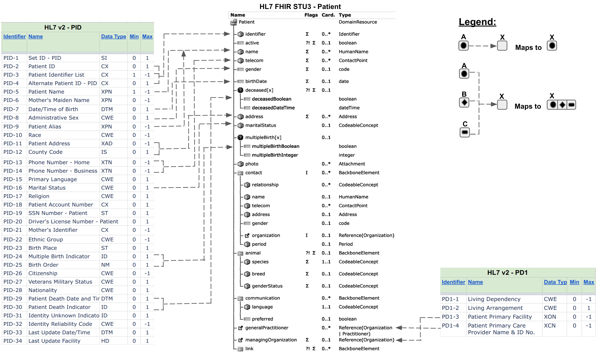
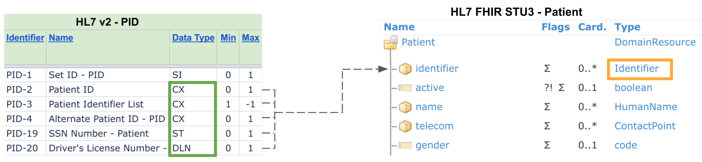
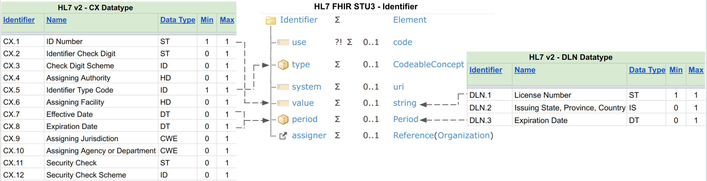

# HL7 v2 to FHIR: Mapping Guide

This document describes a mapping guide to transform
[HL7 v2 (version 2.9) to FHIR STU3 resources](TODO:link to a runnable example of these mappings)(TODO)
using the
[Whistle Data Transformation Language](http://github.com/GoogleCloudPlatform/healthcare-data-harmonization/blob/master/mapping_language/doc/index.md?cl=head).
A mapping process aims towards identifying alignments between source and target
schemas for achieving data transformation and mediation between two or more data
sources. A mapping process is outlined via the following steps:

## Mapping Gap Analysis

First, conduct a mapping gap analysis between
[source](https://www.hl7.org/implement/standards/product_brief.cfm?product_id=185)
(HL7 v2) and [target](https://www.hl7.org/fhir/STU3/) (FHIR STU3). Mapping gap
analysis is outlined via the following steps:

TODO(b/158834870): Create an example for a concept

*   Find candidate mappings between source and target concepts
*   Find candidate mappings between source and target attributes
*   Ensure mandatory target concepts and attributes (as required by the target
    model) are mapped
*   Document unmapped concepts and attributes for further considerations

In the HL7 v2 to FHIR project, let us consider a mapping gap analysis between
HL7 v2
[`PID`, `PD1`](http://cs/google3/third_party/cloud_healthcare_data_harmonization/mapping_configs/hl7v2_fhir_stu3/adt_a01_pid_pd1.hl7.fhir.input.json)
segments and HL7 FHIR `Patient` resource, shown below.



## Mapping Configurations

Based on the example mapping gap analysis discussed above, integration analysts
and developers can define data tranformation by declaring mapping configurations
using
[Whistle Data Transformation Language](http://github.com/GoogleCloudPlatform/healthcare-data-harmonization/blob/master/mapping_language/doc/reference.md?cl=head).

### Datatype Transformation {.leaf-numbered}

Datatype transformation may be needed to transform a source attribute into a
target attribute when an attribute contains complex datatypes. For example, the
source 'PID' fields (`PID-2`, `PID-3`, `PID-4`, `PID-19`, `PID-20`) and the
target 'identifier' attribute both contain complex datatypes. In this specific
case, source datatypes 'CS', 'ST' and 'DLN' (highlighted in green) should be
mapped to a target data type' Identifier' (highlighted in orange) as shown in
the figure below.



Additional mappings are needed to be defined to transform `CX`, `ST` and `DLN`
datatypes into an `Identifier` datatype, shown below:



The above highlighted datatype transformations are defined using
[Whistle syntax](http://github.com/GoogleCloudPlatform/healthcare-data-harmonization/blob/master/mapping_language/doc/index.md?cl=head)
listed below:

*   Datatype Transformation: `CX` to `Identifier`

```
// Description: Constructs Identifier datatype
//
// Argument(s):
//   CX datatype
//
// Output(s):
//   Identifier datatype : https://www.hl7.org/fhir/stu3/datatypes.html#Identifier
//
def CX_Identifier(CX) {
  value : CX.1;
  type.coding[].code : CX.5;
  period.start : Convert_DateTime(CX.7);
  period.end : Convert_DateTime(CX.8);
}
```

*   Datatype Transformation: `ST` to `Identifier`

```
// Description: Constructs Identifier datatype
//
// Argument(s):
//   ST datatype, in the context PID.19 - SSN Number - Patient
//
// Output(s):
//   Identifier datatype : https://www.hl7.org/fhir/stu3/datatypes.html#Identifier
//
def ST_Identifier(ST) {
  value : ST;
  type.coding[0].code : "SB";
}
```

*   Datatype Transformation: `DLN` to `Identifier`

```
// Description: Constructs Identifier datatype
//
// Argument(s):
//   DLN datatype
//   varCode: a code string to be mapped with Identifier.type code
// Output(s):
//   Identifier datatype : https://www.hl7.org/fhir/stu3/datatypes.html#Identifier
//
def DLN_Identifier(DLN, varCode) {
  value : DLN.1;
  type.coding[].code: varCode;
  system : DLN.2.1;
  period.end : DLN.3;
}
```

*   Datatype Transformation: `DT` to `DateTime`

```
// Description: Converts HL7v2 DateTime to FHIR DateTime format
//
// Argument(s):
//   str:  HL7v2 DateTime datatype
//
// Output(s):
//   FHIR DateTime datatype: https://www.hl7.org/fhir/stu3/datatypes.html#dateTime
//
def Convert_DateTime(str) {
  var input : $MultiFormatParseTime(GetTimeFormats(), str);
  $this: $ReformatTime(GetRFC3339(), input, "2006-01-02T15:04:05+01:00");
}

// Description: Creates a list of Time Formats to be used by MultiFormatParseTime()
// The function has a default list of formats that can be modified to meet specific
// requirements. Time formats should adhere to Golang time format layout
// (https://golang.org/pkg/time/#Time.Format)
//
// Argument(s):
//
// Output(s):
//    Array of DateTime Formats that will be used for parsing incoming DateTime fields.
//
def GetTimeFormats() {
  $this: $ListOf("20060102150405-0600", "20060102150405.999999", "20060102150405", "200601021504", "20060102")
}

// Description: Returns a Time format for RFC3339 with second precision
// Time Format should adhere to Golang time format layout
// (https://golang.org/pkg/time/#Time.Format)
//
// Argument(s):
//
// Output(s):
//    Time format for RFC3339 to second
//
def GetRFC3339() {
  $this: "2006-01-02T15:04:05Z";
}

```

Other datatype transformation required to map `PID`, `PD1` fields and `Patient`
attributes are listed below:

*   Datatype Transformation: `DT` to `Date`

```
// Description: Extracts a date in FHIR format from a HL7v2 DateTime datatype
//
// Argument(s):
//   str:  HL7v2 DateTime datatype
//
// Output(s):
//   FHIR Date datatype: https://www.hl7.org/fhir/stu3/datatypes.html#date
//
def Extract_Date(str) {
  var input : $MultiFormatParseTime(GetTimeFormats(), str);
  $this: $ReformatTime(GetRFC3339(), input, "2006-01-02");
}
```

*   Datatype Transformation: `CWE` to `CodeableConcept`

```
// Description: Constructs CodeableConcept datatype
//
// Argument(s):
//   CWE datatype
//
// Output(s):
//   CodeableConcept datatype : https://www.hl7.org/fhir/stu3/datatypes.html#CodeableConcept
//
def CWE_CodeableConcept(CWE) {
  coding[0].code : CWE.1;
  coding[0].display : CWE.2;
  coding[0].system : CWE.3;
  coding[1].code : CWE.4;
  coding[1].display : CWE.5;
  coding[1].system : CWE.6;
  coding[0].version : CWE.7;
  coding[1].version : CWE.8;
  text : CWE.9;
  coding[2].code : CWE.10;
  coding[2].display : CWE.11;
  coding[2].system : CWE.12;
  coding[2].version : CWE.13;
}
```

*   Datatype Transformation: `CWE` to `Code`

```
// Description: Constructs Code datatype
//
// Argument(s):
//   CWE datatype
//
// Output(s):
//   Code datatype : https://www.hl7.org/fhir/stu3/datatypes.html#code
//
def CWE_Code(CWE) {
  if (~CWE.1?) {
    $this : CWE.4;
  } else {
    $this : CWE.1;
  }
}
```

*   Datatype Transformation: `XPN` to `HumanName`

```
// Description: Constructs HumanName datatype
//
// Argument(s):
//   XPN datatype
//
// Output(s):
//   HumanName datatype : https://www.hl7.org/fhir/stu3/datatypes.html#HumanName
//
def XPN_HumanName(XPN) {
  family : FN_Family(XPN.1);
  given[] : XPN.2;
  given[] : XPN.3;
  suffix[] : XPN.4;
  prefix[] : XPN.5;
  suffix[] : XPN.6;
  var use_code: $HarmonizeCode("$Local", XPN.7, "http://hl7.org/fhir/name-use", "Name_Type");
  use : use_code[0].code;
  if (~XPN.12? and ~XPN.13?) {
    period : DR_Period(XPN.10);
  }
  period.start : Convert_DateTime(XPN.12);
  period.end : Convert_DateTime(XPN.13);
  suffix[] : XPN.14;
}
```

*   Datatype Transformation: `XAD` to `Address`

```
// Description: Constructs Address datatype
//
// Argument(s):
//   XAD datatype
//
// Output(s):
//   Address datatype : https://www.hl7.org/fhir/stu3/datatypes.html#Address
//
def XAD_Address(XAD) {
  $this : SAD_AddressLine(XAD.1);
  line[] : XAD.2;
  city : XAD.3;
  state : XAD.4;
  postalCode : XAD.5;
  country : XAD.6;
  if (XAD.7 = "M" or XAD.7 = "SH") {
    type : XAD.7;
  }
  if (XAD.7 = "BA" or XAD.7 = "BI" or XAD.7 = "C" or XAD.7 = "B" or XAD.7 = "H" or XAD.7 = "O") {
    use : XAD.7;
  }
  district : CWE_String(XAD.9);
  period : DR_Period(XAD.12);
  period.start : Convert_DateTime(XAD.13);
  period.end : Convert_DateTime(XAD.14);
  line[] : XAD.19;
}
```

*   Datatype Transformation: `XTN` to `ContactPoint`

```
// Description: Constructs ContactPoint datatype
//
// Argument(s):
//   XTN datatype
//
// Output(s):
//   ContactPoint datatype : https://www.hl7.org/fhir/stu3/datatypes.html#ContactPoint
//
def XTN_ContactPoint(XTN, cUse) {
  if (XTN.1?) {
    $this: Build_ContactPoint(XTN.1, "", cUse, XTN.18, XTN.13, XTN.14);
  }
}

// Description: Constructs ContactPoint datatype
//
// Argument(s):
//   varValue, varSystem, varUse, varRank, varStart, varEnd : respective values are passed to construct a ContactPoint datatype
//
// Output(s):
//   ContactPoint datatype : https://www.hl7.org/fhir/stu3/datatypes.html#ContactPoint
//
def Build_ContactPoint(varValue, varSystem, varUse, varRank, varStart, varEnd) {
  value : varValue;
  system : varSystem;
  use : varUse;
  rank : varRank;
  period.start : Convert_DateTime(varStart);
  period.end : Convert_DateTime(varEnd);
}
```

### Vocabulary Transformation {.leaf-numbered}

Some attributes contain values drawn from a pre-defined vocabulary (i.e. value
set), known as *controlled vocabulary attributes*. In order to transform such
attributes, we require mappings between their respective value-sets. For
example, based on the above-mentioned gap analysis exercise, both `PID-8`
(Administrative Sex) and `gender` are found as controlled vocabulary attributes,
and therefore requires vocabulary transformation between their value-sets, shown
in Figure below:

{style="display:block;width:610px;margin:auto"}

Based on the above scenario, mappings between `PID-8` (Administrative Sex) and
`gender` value-sets are defined as
[FHIR Concept Maps](https://www.hl7.org/fhir/conceptmap.html), listed below:

```
{
  "group": [
    {
      "element": [
        {
          "code": "F",
          "display": "Female",
          "target": [
            {
              "code": "female",
              "display": "Female",
              "equivalence": "equivalent"
            }
          ]
        },
        {
          "code": "M",
          "display": "Male",
          "target": [
            {
              "code": "male",
              "display": "Male",
              "equivalence": "equivalent"
            }
          ]
        },
        {
          "code": "O",
          "display": "Other",
          "target": [
            {
              "code": "other",
              "display": "Other",
              "equivalence": "equivalent"
            }
          ]
        },
        {
          "code": "U",
          "display": "Unknown",
          "target": [
            {
              "code": "unknown",
              "display": "Unknown",
              "equivalence": "equivalent"
            }
          ]
        },
        {
          "code": "A",
          "display": "Ambiguous",
          "target": [
            {
              "code": "other",
              "display": "Other",
              "equivalence": "equivalent"
            }
          ]
        },
        {
          "code": "N",
          "display": "Not applicable",
          "target": [
            {
              "code": "other",
              "display": "Other",
              "equivalence": "equivalent"
            }
          ]
        }
      ],
      "source": "HL70001",
      "target": "http://hl7.org/fhir/administrative-gender",
      "unmapped": {
        "mode": "fixed",
        "code": "unknown",
        "display": "Unknown"
      }
    }
  ],
  "id": "Gender",
  "resourceType": "ConceptMap",
  "version": "v1"
}
```

Based on the above-mentioned concept map, vocabulary transformation between
value-sets are defined using
[Whistle syntax](http://github.com/GoogleCloudPlatform/healthcare-data-harmonization/blob/master/mapping_language/doc/reference.md?cl=head#code-harmonization)
below:

```
// Description: Converts HL7 v2 terminology into FHIR terminology
//
// Argument(s):
//   HL7 v2 Code:  https://hl7-definition.caristix.com/v2/HL7v2.7/Tables
//   ConceptMapID: https://www.hl7.org/fhir/conceptmap.html
//
// Output(s):
//   FHIR Code datatype: https://www.hl7.org/fhir/stu3/datatypes.html#code
//
def Convert_TerminologyCode(Code, ConceptMapID){
  var mapping : $HarmonizeCode("$Local", Code, "", ConceptMapID);
  $this : mapping[0].code;
}
```

### Data Element (Segment) Transformation {.leaf-numbered}

Based on the mapping gap analysis perfomed between `PID`, `PD1` segments and
`Patient` resource, and their Datatype and Vocabulary transformations, `PID`,
`PD1` segments are transfomed into `Patient` resource by defining mappings
between their attributes using
[Whistle syntax](http://github.com/GoogleCloudPlatform/healthcare-data-harmonization/blob/master/mapping_language/doc/index.md?cl=head)
below:

```
// Description: Constructs a FHIR STU3 Patient Resource and its related resources based on V2 PID & PD1 Segments
//
// Argument(s):
//   PID V2 Segment
//   PD1 V2 Segment
//
// Output(s):
//   Patient: https://www.hl7.org/fhir/stu3/patient.html
//   Organization: https://www.hl7.org/fhir/stu3/organization.html
//   Practitioner: https://www.hl7.org/fhir/stu3/practitioner.html
//
def PID_PD1_Patient(PID, PD1) {
  identifier[] : CX_Identifier(PID.2);
  identifier[] : CX_Identifier(PID.3[]);
  identifier[] : CX_Identifier(PID.4[]);
  name[] : XPN_HumanName(PID.5[]);
  birthDate : Extract_Date(PID.7);
  gender : Convert_TerminologyCode(CWE_Code(PID.8), "Gender");
  name[] : XPN_HumanName(PID.9[]);
  address[] : XAD_Address(PID.11[]);
  telecom[] : XTN_ContactPoint(PID.13[], "home");
  telecom[] : XTN_ContactPoint(PID.14[], "work");
  maritalStatus : CWE_CodeableConcept(PID.16);
  identifier[] : ST_Identifier(PID.19);
  identifier[] : DLN_Identifier(PID.20, "DL");
  if (~PID.25?) {
    multipleBirthBoolean : PID.24;
  }
  multipleBirthInteger : PID.25;
  deceasedDateTime : Convert_DateTime(PID.29);
  if (~PID.29?) {
    deceasedBoolean : PID.30;
  }
  meta.lastUpdated : Convert_DateTime(PID.33);
  telecom[] : XTN_ContactPoint(PID.40[], "home");
  generalPractitioner[] : Build_Reference(Output_Resource[](XON_Organization[](PD1.3[])));
  generalPractitioner[] : Build_Reference(Output_Resource[](XCN_Practitioner[](PD1.4[])));
  active : true;
  id : $UUID();
  resourceType : "Patient";
}
```

### Transformation Post-processing and Utilities {.leaf-numbered}

[Post-processing](http://github.com/GoogleCloudPlatform/healthcare-data-harmonization/blob/master/mapping_language/doc/reference.md?cl=head#post-processing-post)
and outputing utilities are defined to collect and output transformation
results, are listed below:

*   Collect transformed FHIR resources

```
def Output_Resource(item) {
  out Resources : item;
  $this : item;
}
```

*   Build Reference to a transformed FHIR resource

```
def Build_Reference(Resource) {
  if (Resource.resourceType?){
    reference : $StrCat(Resource.resourceType, "/", Resource.id);
  }
}
```

*   Build a FHIR Bundle Entry based on each transformed FHIR resource

```
def Build_BundleEntry(Resource,Verb) {
  resource : Resource;
  if (~Resource.id?){
    resource.id : $Hash(Resource);
  }
  request.method : Verb;
  request.url : $StrCat(Resource.resourceType, "/", dest resource.id);
}
```

*   Build and output a FHIR Bundle transaction based on all transformed FHIR
    resources

```
def Output_Transaction(Output) {
  var Resources: $Unique(Output.Resources);
  timestamp : Output.Bundle.timestamp;
  identifier : Output.Bundle.identifier;
  resourceType : "Bundle";
  type : "transaction";
  entry[] : Build_BundleEntry(Resources[], "PUT");
}
```
